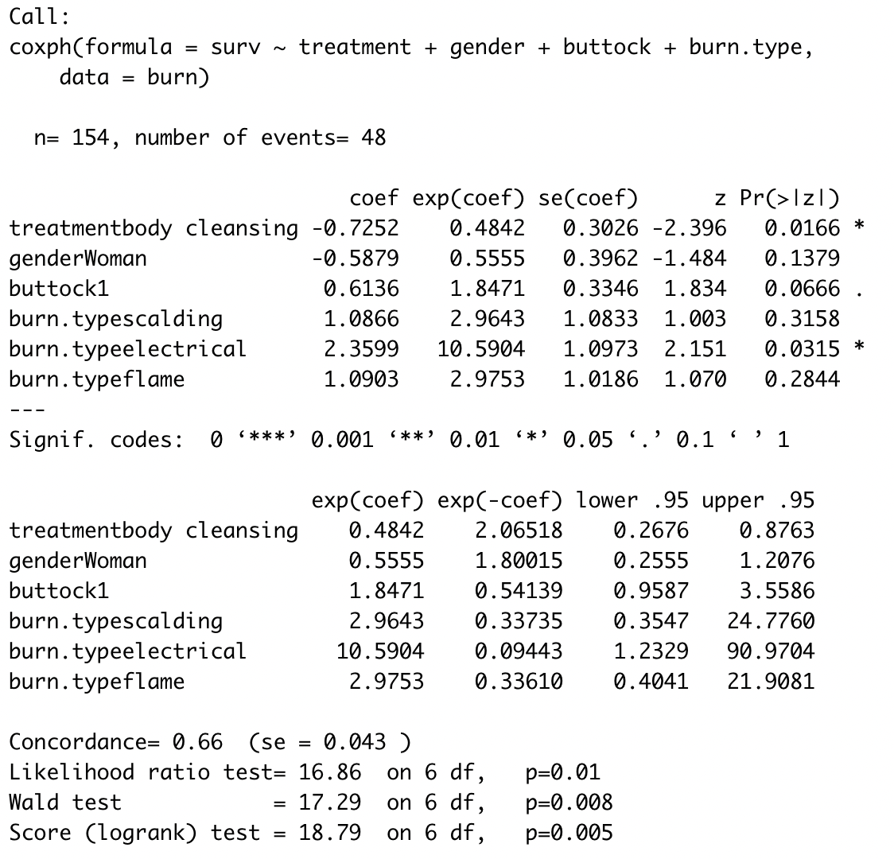

\renewcommand{\contentsname}{Índice}
\renewcommand{\figurename}{Figura}
\renewcommand{\tablename}{Tabla}

\captionsetup{width=.75\textwidth}


\vspace{140mm}

<center>
{width="50%"}
</center>

\newpage


```{r setup, include=FALSE}
knitr::opts_chunk$set(
	fig.align = "center",
	warning = FALSE,
	cache = FALSE,
	echo = FALSE,
	out.width = "70%",
	tidy = TRUE,
	include = FALSE,
	tidy.opts = list(width.cutoff = 60),
	results = "hide"
)
knitr::opts_chunk$set(tidy.opts=list(width.cutoff=50), tidy=TRUE)
library(knitr)
library(survival)
library(FHtest)
library(tidyverse)
library(lsr)
library(ggplot2)
library(dplyr)
library(patchwork)
library(gridExtra)
library(rms)
library(kableExtra)
library(RColorBrewer)
```

```{r}
burn <- read.table("Burn.txt", skip = 32)
  
colnames(burn) = c("treatment", "gender", "burn.percentage", "head", "buttock", "torso", "upper.leg", "lower.leg", "respiratory.system", "burn.type", "time", "cens")

burn$gender = factor( burn$gender, levels = c(0,1), labels=c("Man", "Woman"))
burn$treatment = factor( burn$treatment, levels = c(0,1), labels=c("bathing care", "body cleansing"))
burn$burn.type = factor( burn$burn.type, levels = c(1, 2, 3, 4), labels=c("chemical", "scalding", "electrical", "flame"))

for(i in c(4:9))
  burn[,i] = as.factor(burn[,i])

# burn$cens = as.factor(1-burn$cens)    # Stafilococcus infection = no cens

summary(burn)

# https://en.wikipedia.org/wiki/Detoxification_(alternative_medicine))

```

# Introduction

## Description of the problem

Burns are a significant cause of morbidity and mortality, with infection being the primary cause of death in burn patients, accounting for 51% of deaths, particularly within the first 24 hours post-injury. The lack of epidermis and circulation in burn wounds makes them a prime environment for bacterial growth. Within the first 4/5 hours of the burn, the wound surface becomes contaminated with various bacterial flora, which rapidly multiply and spread through the vascular and lymphatic vessels, leading to bacteraemia and sepsis. Additionally, the release of various cell mediators in burn patients can result in deficiencies in the immune system, making them more susceptible to infection. If left untreated, septic shock, multiple organ failure, and ultimately death can occur.

The most common bacteria found in burn wound culture are Staphylococcus (55%), Pseudomonas aeruginosa (14.29%), Enterococcus (12.24%), Escherichia coli (4%), Klebsiella, and Proteus (both 2%). The severity and extent of burn injury are major risk factors for the development of infection in burn patients. Burns that involve a larger surface area of the body and burns that are deeper or more severe have a higher risk of becoming infected.

In order to prevent and manage infection in burn patients, various treatment methods have been developed. Two commonly used methods are bathing care and body cleansing. Bathing care involves the daily cleaning of the burn wound with a mild soap and water, followed by the application of a topical antimicrobial agent. Body cleansing, on the other hand, involves the use of an antiseptic solution, such as chlorhexidine, to cleanse the wound. Both methods aim to reduce bacterial colonization and prevent infection. However, the effectiveness of these treatments may vary depending on the type and severity of the burn, as well as the specific bacteria present in the wound. 

This report aims to compare the effectiveness of bathing care and body cleansing in the management of burn wounds, using a dataset of 154 patients who have been treated with one of these methods.

\newpage

# Descriptive analysis

The present study utilizes a dataset of 154 patients from a study on the effectiveness of two different burn treatments on different parts of the body. Data was collected on treatment type, gender, burn percentage, burn location (head, buttock, torso, upper leg, lower leg, respiratory system), burn type, time on study, and occurrence of Staphylococcus infection.

* The sample is evenly divided between the two treatments, with 70 patients receiving bathing care and 84 receiving body cleansing. 
\
* The majority of the sample is male, with 120 males and 34 females.
\
* The burn percentage ranges from 2% to 95% with a mean of 24.96 and a median of 20. The distribution is slightly skewed to the right.
\
* The burn location is recorded as binary variables, with 70 patients (45%) having a burn on the head, 35 (23%) on the buttock, 130 (84%) on the torso, 63 (41%) on the upper leg, 47 (31%) on the lower leg, and 45 (29%) in the respiratory system.
\
* The burn type has 4 levels: "chemical", "scalding", "electrical" and "flame", with the majority of cases being flame burns (116 cases), followed by scalding (18 cases), electrical (11 cases), and chemical (9 cases).
\
* The survival time in the study ranges from 1 day to 97 days, with a mean of 21.80 and a median of 17.00. The data is skewed to the left.
\
* The occurrence of Staphylococcus infection is reported in 106 patients (69%). As there are a significant number of censored observations, this may lead to a lower accuracy and effectiveness of the results of our analyses.


```{r}
# round(sum(burn$cens==0)/length(burn$cens)*100, 0)
```

```{r ggpairs_sise, out.width="90%", fig.align='center', include = TRUE}
# library(ggplot2)
# library(GGally)
# 
# my_dens <- function(data, mapping, ...) {
#   ggplot(data = data, mapping=mapping) +
#     geom_density(..., mapping = ggplot2::aes(color = treatment, alpha = 0.7), fill=NA) 
# }
# 
# ggpairs(
#   burn[,],
#   mapping = ggplot2::aes(color = treatment, alpha = 0.8),
#   diag = list(continuous = my_dens),
#   upper = list(continuous = wrap("density", alpha = 0.5), combo = "box_no_facet"),
#   lower = list(continuous = wrap("points", alpha = 0.3), combo = wrap("dot_no_facet", alpha = 0.4)),
#   title = ""
# )
```


First we observe how our data are distributed:

```{r include=TRUE}
#BURN TYPE
df1 <- burn %>%
  group_by(burn.type) %>%
  summarise(counts = n())

plot1 = ggplot(df1, aes(x = burn.type, y = counts)) +
  geom_bar(fill = "royalblue3", stat = "identity") +
  scale_fill_brewer(palette = "Dark2") # +
  # geom_text(aes(label = counts), vjust = -0.3) c("green3", "royalblue3", "yellow2", "red3")


#GENDER
df2 <- burn %>%
  group_by(gender) %>%
  summarise(counts = n())

plot2 = ggplot(df2, aes(x = gender, y = counts)) +
  geom_bar(fill = c("yellow2", "salmon2"), stat = "identity") # + 
  # geom_text(aes(label = counts), vjust = -0.3)


#TREATMENT
df3 <- burn %>%
  group_by(treatment) %>%
  summarise(counts = n())

plot3 = ggplot(df3, aes(x = treatment, y = counts)) +
  geom_bar(fill = c("royalblue3", "orange2"), stat = "identity") # + 
  # geom_text(aes(label = counts), vjust = -0.3)


#BURN PERCENTAGE
binwidth = 4.5
plot4 = ggplot(burn, aes(x=burn.percentage)) + 
  geom_histogram(color="black", fill= heat.colors(round(100/binwidth), rev = T), binwidth = binwidth)


#BODY AREA
df5 = data.frame( area = c("head", "buttock", "torso", "upper.leg", "lower.leg", "Respiratory.system"), counts = c(sum(burn$head==1), sum(burn$buttock==1), sum(burn$torso==1), sum(burn$upper.leg==1), sum(burn$lower.leg==1), sum(burn$respiratory.system==1)) ) 

plot5 = ggplot(df5, aes(x = area, y = counts)) +
  geom_bar(fill = "royalblue3", stat = "identity") + #0073C2FF
  theme(axis.text  = element_text(size=5))

  #geom_text(aes(label = counts), vjust = -0.3) 

grid.arrange(plot1, plot3, plot4, plot5, ncol=2)

# plot5

```

<!-- And then we investigate about the correlation among themselves: -->


\newpage

# Nonparametric analysis

## Estimation of the survival function and the median survival time

The overall survival function is

```{r include = TRUE}
svf <- survfit(Surv(time, cens) ~ 1, burn)

par(las = 1, font = 2, font.axis = 2, font.lab = 4, bty = "l", mar = c(5, 5, 4, 2))
plot(svf, lwd = 2, col=c(1,2,2), xlab = "Survival time [Days]",
     ylab = expression(bolditalic(hat(S)(t))), xaxs = "i", yaxs = "i", mark.time = F)
abline(h=0.5, lty=2)
title("Survival function")
```

```{r}
temp = min(which(svf$surv<=0.5))
med_surv_time = svf$time[temp]
```

and the median survival time is `r med_surv_time` days.

## Comparison of survival functions by means of nonparametric tests

An examination of the survival function for different levels of the categorical covariates reveals notable variations in the patterns.

In order to thoroughly investigate the impact of the two treatments on the patients, we will conduct an analysis of their individual effects, as well as an examination of their interactions with other covariates.

```{r}
svf <- npsurv(Surv(time, cens) ~ treatment, burn)

par(font = 2, font.axis = 2, font.lab = 4, las = 1, mar = c(5, 5, 4, 2))
survplot(svf, ylab = expression(bold(hat(S)(t))), col = 1:2, lwd = 3, xlab="Survival time [Days]")
title("Survival functions according to treatment")
abline(h=0.5, lty=2)
```

```{r}
formula = with(burn, Surv(time, cens) ~ treatment)

library(FHtest)
FHtestrcc(formula, rho = 1, lambda = 1)
```

<!-- - treatment: -->
<!-- For both treatment groups the survival function behaves similarly for the first 5 years, then -->
<!-- they move apart a little, with ddc treatment having a higher survival probability until the -->
<!-- end of the study when both functions reach approximately the same level. The log-rank test, -->
<!-- used on both groups shows the same result, with Chi-sq= 2.1 on 1 degree of freedom, we -->
<!-- receive p= 0.2. Therefore, there is no significant difference to be found in the behavior of -->
<!-- both survival functions. -->

**Treatment**

A clear difference in the survival function is observed between the two treatments. The survival function for body cleansing is generally higher than that for bathing care, indicating that body cleansing is more effective in preventing or delaying the onset of Staphylococcus infection. Both survival functions are relatively smooth and stabilize at values of 0.662 and 0.404, respectively, after 51 days.
To test the significance of this difference, we perform a Fleming-Harrington test with parameters $\rho=1$ and $\lambda=1$. The test returns a p-value of 0.4, which confirms at a 5% level that there is a significant difference in the central part of the infection process between the two treatments.


```{r}
#GENDER
n=length(levels(burn$gender))
svf <- survfit(Surv(time, cens) ~ gender + treatment, burn)
svf1 <- survfit(Surv(time, cens) ~ gender, burn)

names=c()
for(i in 1:n){
  for(j in 1:2){
    names=c(names, paste(levels(burn$gender)[i], " receiving ", levels(burn$treatment)[j], sep=""))
  }
}

par( mfrow=c(1,2), las = 1, font = 2, font.axis = 2, font.lab = 4, bty = "l",
    mar = c(5, 5, 4, 2))

#UNIVARIATE
plot(svf1, col = 1:n, lty = c(rep(1, n), rep(2, n)), lwd = 3, xlab = "Survival time [Days]",
     ylab = expression(bolditalic(hat(S)(t))), xaxs = "i", yaxs = "i", mark.time = F)
abline(h=0.5, lty=2)
legend("bottomleft", levels(burn$gender), lwd = 3, col = 1:n, lty = c(rep(1, n), rep(3, n)), bty = "n", cex=0.8)
# title( paste("Survival functions according to gender" ))

#BIVARIATE
plot(svf, lty = 1:n, col = c(rep(1, n), rep(2, n)), lwd = 3, xlab = "Survival time [Days]",
     ylab = expression(bolditalic(hat(S)(t))), xaxs = "i", yaxs = "i", mark.time = F)
abline(h=0.5, lty=2)
legend("bottomleft", names, lwd = 3, lty = c(1,3), col = c(rep(1, n), rep(2, n)), bty = "n", cex=0.8)
# title( paste("Survival functions according to gender" ))

mtext("Survival functions according to gender", side = 3, line = -2, outer = TRUE)

```

**Gender**

Comparing the survival functions of male and female patients, we observe that women have a higher overall survival probability, although the two curves converge at around 40 days. We also conduct a bivariate analysis, dividing the observations by both gender and treatment. This analysis confirms a higher survival probability for women compared to men, and a significant difference between the two treatments, particularly in the long-term, so that men receiving bathing care reach a survival probability of 0.16 after 51 days.
However, a Logrank test on the gender variable
$$ \begin{cases} H_0: S_{men}(t)=S_{women}(t) \\ H_1: S_{men}(t) \neq S_{women}(t) \end{cases} $$
yields a $\chi^2$ statistic of 2.4 on 1 degree of freedom and a p-value of 0.1. Therefore, we do not have enough evidence to conclude that the survival times for male and female patients are different.

```{r}
formula = with(burn, Surv(time, cens) ~ gender)
survdiff(formula)
```

**Body parts**

We then study the influence of the location of the burn on the observed survival times.
A graphical analysis suggests that differences are negligible for all variables, as the survival functions tend to overlap or follow similar patterns. Only the variable for burns on the buttock shows a diverging pattern from day 0 to day 51, after which the curves cross and remain close to each other.
To confirm this hypothesis, we perform Logrank tests on these variables:

$$ \begin{cases} H_0: S_0(t)=S_1(t) \\ H_1: S_0(t) \neq S_1(t) \end{cases} $$

It is important to note that the goal of this study is to analyze the effects of the treatments in relation to the available covariates, but in this case no stratified test was performed as the groups were quite balanced (likely due to the design of the experiment), meaning that the two treatments were present in approximately equal numbers throughout the study of all variables.

The tests are not significant, most of them with very high p-values (in the range $[0.45, 0.73]$). It is interesting to note that the variable for burns on the buttock has the smallest p-value ($0.27$) and is the most significant among the location variables.

```{r}
pvalues=c()

formula = with(burn, Surv(time, cens) ~ head)
pvalues = c(pvalues, 1 - pchisq(survdiff(formula)$chisq, 1))

formula = with(burn, Surv(time, cens) ~ torso)
pvalues = c(pvalues, 1 - pchisq(survdiff(formula)$chisq, 1))

formula = with(burn, Surv(time, cens) ~ buttock)
pvalues = c(pvalues, 1 - pchisq(survdiff(formula)$chisq, 1))

formula = with(burn, Surv(time, cens) ~ upper.leg)
pvalues = c(pvalues, 1 - pchisq(survdiff(formula)$chisq, 1))

formula = with(burn, Surv(time, cens) ~ lower.leg)
pvalues = c(pvalues, 1 - pchisq(survdiff(formula)$chisq, 1))

formula = with(burn, Surv(time, cens) ~ respiratory.system)
pvalues = c(pvalues, 1 - pchisq(survdiff(formula)$chisq, 1))

df = data.frame(body_part = c("head","torso", "buttock", "upper_leg","lower_leg", "respiratory_system"), pvalue = pvalues)
df
```


```{r include=T}
#burn.type
n=length(levels(burn$burn.type))
svf <- survfit(Surv(time, cens) ~ burn.type + treatment, burn)
svf1 <- survfit(Surv(time, cens) ~ burn.type, burn)

names=c()
for(i in 1:n){
  for(j in 1:2){
    names=c(names, paste("burn.type=", levels(burn$burn.type)[i], " and treatment=", levels(burn$treatment)[j], sep=""))
  }
}

par( las = 1, font = 2, font.axis = 2, font.lab = 4, bty = "l",
    mar = c(5, 5, 4, 2))

#UNIVARIATE
plot(svf1, col = 1:n, lty = c(rep(1, n), rep(2, n)), lwd = 3, xlab = "Survival time [Days]",
     ylab = expression(bolditalic(hat(S)(t))), xaxs = "i", yaxs = "i", mark.time = F)
abline(h=0.5, lty=2)
legend("bottomleft", levels(burn$burn.type), lwd = 3, col = 1:n, lty = c(rep(1, n), rep(3, n)), bty = "n", cex=0.8)
title( paste("Survival functions according to burn type" ))


# mtext("Survival functions according to burn type", side = 3, line = -2, outer = TRUE)
```

**Burn type**


Finally, we have compared the severity of different types of burns, specifically Chemical, Scalding, Electrical, and Flame.

* The survival function for scalding and electrical burns is the most critical in the initial days after the accident, with scalding burns reaching a survival probability of 0.667 after 7 days and electrical burns reaching a survival probability of 0.436 after only 13 days (which is significantly lower compared to the median survival time of r med_surv_time days).

* The burn type with the highest survival probability is chemical burns, however this level has only one uncensored observation, therefore it is not possible to make a fair comparison between the groups with the available data.

* Lastly, the survival function for flame burns shows a smoother trend, reaching a survival probability of 0.473 after 51 days. 

In general, this variable presents diverse patterns. This can be confirmed through a Logrank test, which is used to test the null hypothesis that the survival functions for the four burn types are equal.
$$ \begin{cases} H_0: S_{Chemical}(t)=S_{Scalding}(t)=S_{Electrical}(t)=S_{Flame}(t) \\ H_1: \exists \space i,j \text{ s.t. } S_i(t) \neq S_j(t)  \end{cases} $$

```{r}
formula = with(burn, Surv(time, cens) ~ burn.type)
survdiff(formula)
```

\newpage

# Fit of a parametric survival model

## Fit of a Weibull and a Log-logistic model

We'll fit the Weibull model:
$$Y = \ln T = \mu + \gamma_1\cdot treatment + \gamma_2\cdot gender + \gamma_3\cdot head + \gamma_4\cdot buttock + \gamma_5\cdot torso + \gamma_6\cdot upper \textunderscore leg$$ 
$$+ \gamma_7\cdot lower \textunderscore leg + \gamma_8\cdot respiratory \textunderscore system + \gamma_9\cdot burn \textunderscore type + \gamma_{10}\cdot burn\textunderscore percentage + \sigma \cdot W$$ 

```{r}
#Weibull
surv = with(burn, Surv(time, cens))
```

To simplify the model, we will apply a step-wise feature selection process, using the Akaike Information Criterion (AIC) as the criterion for selecting variables. AIC is a measure of the trade-off between the goodness of fit of the model and its simplicity, defined as:

$$AIC = 2k - 2\ln(\text{maxLikelihood}), \text{ with } k=\text{number of variables}$$

After this process, the simplified Weibull model obtained is:
$$Y = \ln T = \mu + \gamma_1\cdot treatment + \gamma_2\cdot gender + \gamma_4\cdot buttock + \gamma_9\cdot burn \textunderscore type + \sigma \cdot W$$ 

It is worth noting that this result is consistent with our previous observations and tests on the survival times, as the variables discarded by this feature selection process match those discarded during our earlier analyses.
However, not all variables were discarded in this model, as gender and buttock were identified as significant variables and retained in the simplified model.

A similar feature selection process was performed for a Log-logistic model, and the same set of variables was kept. Thus, we are satisfied with the results of this feature selection phase and can proceed to examine the residuals of the two models.

```{r}
weib_fit = survreg(surv ~ treatment + gender + buttock + burn.type, data = burn)
weib_pred <- predict(weib_fit, type = "linear")
weib_resids <- (log(burn$time) - weib_pred) / weib_fit$scale

survgumb <- function(x) {     #theoretical survival function
  return(exp(-exp(x)))
}
```

```{r}
loglog_fit = survreg(surv ~ treatment + gender + buttock + burn.type, data = burn, dist = "loglogistic")
loglog_pred <- predict(loglog_fit, type = "linear")
loglog_resids <- (log(burn$time) - loglog_pred) / loglog_fit$scale

logistic <- function(x) {  #theoretical survival function
  return(1/(1+exp(x)))
}
```

```{r include = TRUE}
par(mfrow=c(1,2), font = 2, font.lab = 4, font.axis = 2, las = 1, oma = c(0, 0, 1, 0), mar = c(4.8, 5, 2.5, 2))

#WEIBULL
plot(survfit(Surv(weib_resids, burn$cens) ~ 1), xlab = "days", lwd = 2, ylab = expression(bold(hat(S)(t))) , yaxs = "i")
title("Weibull model")
curve(survgumb(x), from = min(weib_resids), to = max(weib_resids), col = 2, lwd = 2,
      add = TRUE)
legend("bottomleft", c("Empirical Residuals", "95% C.I.", "Stand. Gumbel Distribution"),
       col = c(1, 1, 2), lty = c(1, 2, 1), lwd = 3, bty = "n", cex=0.85)

#LOGLOGISTIC
plot(survfit(Surv(loglog_resids, burn$cens) ~ 1), xlab = "days", lwd = 2, ylab = expression(bold(hat(S)(t))) , yaxs = "i")
title("Log-logistic model")
curve(logistic(x), from = min(loglog_resids), to = max(loglog_resids), col = 2, lwd = 2,
      add = TRUE)
legend("bottomleft", c("Empirical Residuals", "95% C.I.", "Stand. Logistic Distribution"),
       col = c(1, 1, 2), lty = c(1, 3, 1), lwd = 3, bty = "n", cex=0.85)
```

From a graphical analysis, it appears that the residuals in both models are similar to the theoretical ones, with most of the functions falling within the confidence intervals. However, upon closer examination, it appears that the Log-logistic model has a slightly better performance as the residuals are completely within the intervals and are closer to the empirical residuals.

This observation is further supported by comparing the log-likelihood of the models, as the Log-logistic model has a higher value.

```{r include = TRUE, results='hold'}
df = data.frame(distribution = c("Weibull", "Log-logistic"), Loglikelihood = c(weib_fit$loglik[2], loglog_fit$loglik[2]))
kable(df, align = "c") %>%
  kable_styling(position = "center")
```

As a result, we have chosen the Log-logistic model as the optimal one to describe our phenomenon and will proceed to interpret it.

## Interpretation of the model fit.

Even though this model was reached after a feature selection phase, not all variables were found to be significant in terms of p-value. 

- The buttock variable and the treatment variable had respective p-values of 0.047 and 0.02
- The burn type variable had its electrical level with a significant p-value of 0.018. 
- The gender variable, with a p-value of 0.087, was the only one that could not be considered significant at level 5%.

Despite this, the overall model fit was good, as evidenced by the global p-value of 0.0033 and the best performance in terms of Likelihood and complexity.

## Interpretation of the model parameters in terms of relative hazards or relative odds, and the accelerating factor

It is well known that a Log-logistic model can be represented as a proportional odds model, with respect to a baseline $Z=0$, as follows:
$$\frac{S(t|Z)}{1-S(t|Z)} = \exp(\frac{\gamma'Z}{\sigma}) \cdot \frac{S(t|Z=0)}{1-S(t|Z=0)}$$


This allows for the interpretation of $\exp(\frac{\gamma_i Z_i}{\sigma})$ as the Odds Ratio between the $i^{th}$ covariate and the baseline, in this case, a man who received a burn of type Chemical. Additionally, the general expression of the Accelerating Factor for a single variable $Z_i$ is $AF = e^{- \gamma_i Z_i}$

```{r include=T}
df = data.frame(gamma = coef(loglog_fit), OR = exp(coef(loglog_fit)/loglog_fit$scale), AFT = exp(-coef(loglog_fit)))[-1,]
df
```

The Odds Ratio represents the ratio of the odds of an event occurring in one group to the odds of the event occurring in another group. 
In our case, we can observe that, for each time t, the odds of surviving under the alternative treatment (body cleansing) are 2.37 times larger than the odds of surviving under the standard treatment (bathing care), confirming our earlier observations about the effectiveness of such treatments. 

Similarly, we can infer that, according to the model, the odds of survival for a woman are more than double those for a man (precisely 2.25). 
Additionally, the low Odds Ratio in the buttock variable (OR=0.44) identifies it as a risk factor, as a person who sustains a burn on their buttock may have their survival odds reduced by almost half.

Finally, by analyzing the Odds Ratios of the burn type variable, we can confirm that Electrical burns are the most severe among the other types, with odds that are significantly lower in comparison to chemical burns (5%), scalding burns (24%), and flame burns (17%). The least dangerous burn type is Chemical, and Scalding and Flame burns can be considered to be of similar risk.

Analogous conclusions can be drawn by analyzing the Accelerating Factor, which indicates how a specific covariate affects an individual's lifespan. In particular, if the Accelerating Factor is less than 1, it means that the covariate is extending the survival time. In this case, we can deduce that being a woman and using the alternative treatment will almost double the lifespan, while sustaining a burn on the buttock or undergoing a scalding, electrical, or flame burn will reduce the lifespan by a factor of 2, 4, 15, and 3 respectively.


\newpage

# Fit of a semi-parametric model

## Fit of the proportional hazards models.

We fit a Cox proportional hazards model to our data, and applied stepwise feature selection to determine which variables were relevant for the study. The final model retained the variables treatment, gender, buttock, and burn type.

The expression of the model is the following:

$$\lambda(t|Z) =  \lambda_0(t) \cdot\exp(\gamma_1 \cdot treatment + \gamma_2 \cdot gender +\gamma_3\cdot buttock + \gamma_4 \cdot burn\_type)$$
where  $burn\_type$ has the four levels: chemical, scalding, electrical, flame.

{width=70%}


```{r}
surv = with(burn, Surv(time, cens))

cox1 <- coxph(surv ~ treatment + gender + head + buttock + torso + upper.leg + lower.leg + respiratory.system + burn.type + burn.percentage, data = burn)
summary(cox1)


step(cox1)
```


```{R}
cox2 <- coxph(surv ~ treatment + gender + buttock + burn.type, data = burn)
summary(cox2)
```

## Interpretation of the model fit.

We observe that for the reduced model we achieve a concordance index of 0.66, which is close to 1, indicating a good fit.

Upon analyzing the coefficients of our model, we find that:

* Treatment has a negative coefficient of -0.7252, indicating that Treatment 2 has a lower hazard ratio compared to Treatment 1, resulting in a higher survival probability. The p-value is 0.0166, which is significant at the 5% level.

* Gender also has a negative coefficient of -0.5879, indicating that the hazard ratio is lower for women, resulting in longer survival times. However, the p-value is 0.1379, which is not significant at the 5% or 10% level.

* Buttock has a positive coefficient of 0.6136, indicating that this variable leads to a higher hazard ratio and lower survival for these patients. However, the p-value of the coefficient is 0.0666, which is not significant at the 5% level.

* Burn type has 4 levels, with the base case being chemical. The coefficients for scalding, electrical, and flame are all positive, indicating that these burn types lead to a greater hazard and lower survival time. The p-values for scalding and flame are not significant at any level below 20%, but the coefficient for electrical is significant at the 5% level.

## Interpretation of the model parameters in terms of relative hazards.

We recall that the Hazard Ratio relative to a variable is compute as: 

$$\text{HR}_{i} = \frac{\lambda(t|Z_i=1)}{\lambda(t|Z_i=0)} = \exp (\beta_i Z_i)$$

This value can be find in the table above under the column of "exp(coef)".

* The hazard ratio for treatment is 0.4842, indicating that the hazard of infection for patients receiving "body cleansing" treatment is 0.4842 times lower than for those receiving "bathing care" treatment.

* The hazard ratio for gender is 0.5555, indicating that being a woman is associated with a 0.5555 times lower hazard of infection compared to being a man.

* The hazard ratio for buttock is 1.8471, indicating that having a burn on the buttock is associated with a 1.8471 times higher hazard of infection compared to other burn locations.

* The hazard ratio for burn type shows that burns caused by scalding, electrical and flame are associated with a 2.9643, 10.5904 and 2.9753 times higher hazard of infection, respectively, compared to chemical burns.

## Analysis of the residuals to check the model’s goodness-of-fit.

The Cox proportional hazards model makes several assumptions, it is important to assess whether the fitted model is valid to describe the data. To do this, we examine influential observations and test the proportional hazards assumption. 
\
One way to do this is by computing the dfbeta residuals, which compare the magnitudes of the largest dfbeta values to the regression coefficients. By examining the distribution of these residuals, we can identify any potential outliers. From the graph, we can see that the residuals are randomly distributed around zero, except for the treatment variable where we see that one point is far away from the others. 
\
This point corresponds to a woman who was treated with "body cleansing," has a burn percentage of 45%, burn on the head, buttock, torso, and upper leg. The burn is chemical, the time under study was 18 days and she was infected by Staphylococcus.
We know that the score based residuals are used to determine the influence of the i-th individual on the estimate. Number 90 appears to be an outlier, but we realize that she is the only subject in the chemical group who is uncensored, so she has a strong influence. 
\
We decide to keep her in the study to represent also this case, in order to avoid bias in our analysis.

```{r fig.show='hide'}
dfbet <- residuals(cox2, type = "dfbeta")
m = dim(dfbet)[2]
par(mfrow = c(2, 2), font = 2, font.lab = 4, font.axis = 2, las = 1,
    cex.lab = 1.3, cex.axis = 1.2)
for (i in 1:m) {
  plot(dfbet[, i], pch = 16, ylab = "")
  title(names(coef(cox2))[i])
  axis(1, at = seq(5, 45, 5))
}
```

```{r }
# id = 6
# par(font = 2, font.lab = 4, font.axis = 2, las = 1, cex.lab = 1.3,
#     cex.axis = 1.2)
# plot(dfbet[, id], pch = 16, ylab = "")
# title(names(coef(cox2))[id])
# axis(1, at = seq(5, 45, 5))
# identify(dfbet[, id],
#          labels = paste0("Row: ", rownames(burn), "; Time: ", burn$time,
#                          "; Cens: ", burn$cens, "; BUN: ", burn$burn.type))
```

```{r}
burn[90,]
```
Then we compute also the Schoenfeld residuals to check if the proportional hazard assumption hold. 

```{r}
res.schoen = residuals(cox2, "schoenfeld")
```


```{r}
cox.zph(cox2)
```

```{r include = TRUE}
par(mfrow = c(2, 2), font = 2, font.lab = 2, font.axis = 2, las = 1,
    cex.lab = 1.3, cex.axis = 1.2)
plot(cox.zph(cox2), lwd = 2)
```

The proportional hazards (PH) assumption is verified using statistical tests and graphical diagnostics based on the scaled Schoenfeld residuals. The function cox.zph() is used to test the proportional hazards assumption for each covariate included in the Cox regression model fit. The results indicate that the test produces high p-values for each variable except for burn type, which has a p-value of 0.03. The global test is not statistically significant at the 5% level, with a p-value of 0.084.
We cannot reject the null hypothesis of the proportional hazards assumption so we should interpret the model with caution.  Additionally, the plot of the residuals shows that the mean line is shifting approximately along the zero line for each variable. For the variable of gender, there is a slight deviation from linearity due to the imbalance in the data, however, it is still reasonable to assume that the residuals are randomly distributed. Therefore, we conclude that the assumption of proportional hazards is still reasonable for this model.

\newpage

# Conclusions

In this report, we analyzed the survival times of burn patients using non-parametric and semi-parametric models.

Our results indicate that the body cleansing treatment is more effective in increasing survival times, with a hazard ratio of 0.48 and an odds ratio of 2.37 compared to the standard treatment. This confirm, together with further analyses, might lead to an investigation and later to a wider use of this procedure and of other procedures which go in the same direction.

We also highlighted the danger of electricity among the causes of accidental burns since it appeared to be the most subjected to infections.

Lastly, we found that burns on the buttock are a significant risk factor, which is coherent with literature. Indeed perineal and buttock burns are challenging wounds to heal for several reasons, because of the contamination risk and the shear stress that is always present. The ideal treatment approach for this area is still not well defined, therefore, given the fact that this covariate proved to be a relevant factor, with an hazard ratio of 1.85 and an odds ratio of 0.44, further research could be carried out in that direction.


# References

[1] Norbury W, Herndon DN, Tanksley J, et al.., Infection in Burns, *Surg Infect (Larchmt)* 2016; 17(2):250-255
\textcolor{blue}{https://www.ncbi.nlm.nih.gov/pmc/articles/PMC4790211/}

[2] Latifi NA and Karimi H, Correlation of occurrence of infection in burn patients, *Ann Burns Fire Disasters* 2017;30(3):172-176
\textcolor{blue}{https://www.ncbi.nlm.nih.gov/pmc/articles/PMC5946749/}

[3] Merchant N, Boudana D, Willoughby L et al.., Management of adult patients with buttock and perineal burns: The Ross Tilley Burn Centre experience, *J Trauma Acute Care Surg* 2014;77(4):640-648
\textcolor{blue}{https://www.ncbi.nlm.nih.gov/pmc/articles/PMC7876611/}
